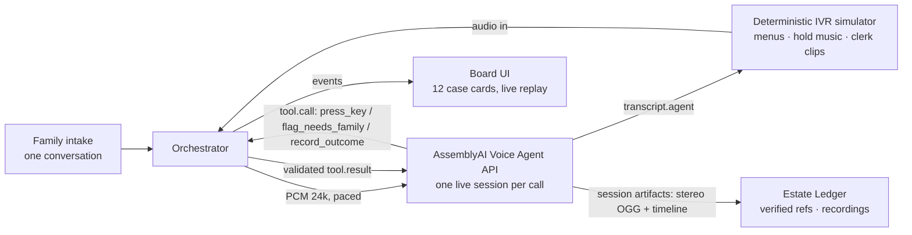

# Afterward — the calls after a death, made for you

> One conversation with the family. Then a voice agent phones every bank, insurer, utility and pension —
> waits on hold, discloses it's an AI, and brings back a **verified case reference and a stereo recording
> for every account**. It never guesses: anything missing becomes a question for the family, never an invention.

**Live demo:** https://afterward-lablab.vercel.app · **Board replay:** `/board` · **Evidence:** `/ledger/est_holt`

Built solo for the **AssemblyAI Voice Agent Hackathon** (Sep 2026).

## The problem

GOV.UK, verbatim: *"You'll also need to tell organisations outside government, like employers and private
pension providers, banks, and utility companies."* The government's Tell Us Once service stops at
government's edge. The UK Death Notification Service covers member banks only. Everyone else answers the
phone — so a grieving family spends days on hold, retelling the death to a dozen call centres.

## What the judges' rubric asks, and where to look

| Criterion | Evidence |
|---|---|
| **Application of Technology** | One live AssemblyAI **Voice Agent API** session per call (WS protocol notes: [docs/voice-agent-api-cheatsheet.md](docs/voice-agent-api-cheatsheet.md)); client-side tools (`press_key` DTMF, `flag_needs_family`, validated `record_outcome`); per-call keyterms; `transcription_mode` switched to `max_accuracy` right before the reference is spoken; sponsor-side **stereo session recordings** (left = institution, right = agent) as the evidence artifacts; turn detection against scripted IVR menus |
| **Originality** | Nobody automates the *calls* — Empathy/Settld are forms and email. The refuse-to-guess Estate Ledger (verified refs + recordings) is a new artifact. Zero of ~110 entries in this hackathon touch bereavement |
| **Business Value** | 650k UK / 2.8M US deaths a year; go-to-market through funeral directors' aftercare; Tell Us Once and the DNS prove institutions want structured notification — Afterward feeds DNS where it exists and calls everyone else |
| **Presentation** | 4-minute video + deck in [docs/](docs/); the board demo needs no sign-in and replays real captured sessions |

## What's real vs simulated (honesty box)

- **Real:** every card replays a genuine Voice Agent session — live STT, turn-taking, tool calls, TTS; the
  reference numbers were heard on-call and verified server-side against ground truth; recordings/timelines
  are unedited sponsor-side artifacts; validator refusals happened mid-call.
- **Simulated, and labelled:** the 12 institutions are fictional. Their lines are a deterministic scripted
  test bed (IVR menus, hold music, clerk voices) modelled on real bereavement lines. **No real institution
  was told of a fictional death — that would be fraud, so we refuse to demo it.**
- **Honest failure hunt:** we degraded one closing line to 6-bit audio at 1.35× speed to force a mishear;
  the STT still captured the reference correctly in most runs — when it ever doesn't, the validator refuses
  the write and the agent asks the clerk to repeat it. Premature record attempts were also refused (captured).

## Measured on the seeded estate (full-length holds)

| | |
|---|---|
| Calls made (full-length holds) | **12** |
| References verified against clerk ground truth | **12 / 12** |
| Unverified writes | **0** |
| Escalated to the family instead of guessed | **2** |
| Validator refusals (all recovered on-call) | **1** |
| Total calling time | **27m 45s**, of which **9m 47s on hold** |
| Family time spent | one brief conversation |

Reproduce: `npm run verify` (offline, asserts the doctrine held over the captured dataset) or
`npm run capture` (re-runs all 12 calls live — needs `ASSEMBLYAI_API_KEY`).

## Quickstart

```bash
npm install
npm run verify        # offline judge-check over the captured dataset — PASS/FAIL
npm run dev           # board + ledger on the captured fixtures, no key needed
# live calls (optional): echo "ASSEMBLYAI_API_KEY=..." > .env.local && npm run spike wessex-bs
```

## Architecture



Design decisions (ADRs, short): [SPEC.md](SPEC.md) · UI contract: [UI-SPEC.md](UI-SPEC.md) ·
protocol notes: [docs/voice-agent-api-cheatsheet.md](docs/voice-agent-api-cheatsheet.md)

## Limitations (stated, not hidden)

- Real institutions require identity verification and documents before *actioning* an estate; Afterward's
  green means what a first human call achieves — **case opened, documents requested** — never "done".
- The PSTN leg (real outbound calls via Twilio SIP) is designed but not wired in this build; the sim test
  bed is the demo. The requirements-discovery call against a real line is the first production milestone.
- One clerk asked for “any other personal details”; the agent had the executor's name in its brief but still
  escalated the open-ended part to the family rather than improvise — over-caution is the failure mode we chose.

MIT licensed. AI-use disclosure in [CLAUDE.md](CLAUDE.md).
