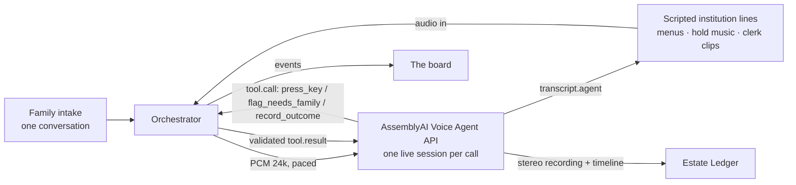

# Afterward

**The calls after a death, made for you.**

Live demo: **https://afterward-lablab.vercel.app** (no sign-in — the board starts replaying on its own) · watch: [`docs/afterward-demo.mp4`](docs/afterward-demo.mp4) · deck: [`docs/deck/afterward-deck.pdf`](docs/deck/afterward-deck.pdf)

Built solo for the AssemblyAI Voice Agent Hackathon, September 2026.

## Why this exists

When someone dies in the UK, the government runs a service called Tell Us Once. One form, and every government department knows. Then GOV.UK tells you, in its own words: *"You'll also need to tell organisations outside government, like employers and private pension providers, banks, and utility companies."*

That sentence is doing a lot of work. It means the family spends the worst week of their lives in phone queues, saying "she died on the 13th" to a dozen different call centres, each with its own menu tree and its own hold music.

Afterward makes those calls instead. You tell it about the death once. It phones each institution, presses the menu keys, sits through the hold, tells whoever answers that it's an AI calling with the family's permission, and comes back with a case reference and a recording for every account. When it's asked for something the family never gave it, it doesn't improvise. The card turns amber and the question goes back to the family.

That last rule isn't a prompt. There's a validator on the server that checks every reference the agent tries to record against what the clerk actually said, and it will refuse its own agent mid-call. It did, once, on a real captured session (Harberton & Vale — you can watch the REFUSED event land on the board).

## What's real and what isn't

I want to be precise about this, because demos in this space usually aren't.

**Real:** every card on the board replays a genuine AssemblyAI Voice Agent session. Live speech-to-text, turn-taking, tool calls, TTS. The reference numbers were heard on-call and verified against ground truth. The recordings and timelines are the sponsor-side session artifacts, unedited. The validator refusal happened mid-call and recovered on the same call.

**Simulated, and labelled on screen:** the twelve institutions are fictional. Their phone lines are a scripted, deterministic test bed (IVR menus, hold music, clerk voices) modelled on real bereavement lines. I did not call a real bank about a fictional death. That would be fraud, so I refuse to demo it, and the roadmap starts with the call that *is* legitimate: phoning real bereavement lines to ask what they'd need from a family.

I also tried to break it: I degraded one clerk's closing line to 6-bit audio at 1.35× speed to force a mishear. The STT still got the reference right. Annoying, but a good problem to have.

## The numbers (measured, not vibes)

| | |
|---|---|
| Calls made, full-length holds | 12 |
| References verified against clerk ground truth | 12 / 12 |
| Unverified writes | 0 |
| Escalated to the family instead of guessed | 2 |
| Validator refusals, recovered on-call | 1 |
| Total calling time | 27m 45s, of which 9m 47s on hold |
| The family's time | one short conversation |

Reproduce with `npm run verify` — it runs offline against the captured dataset and asserts the doctrine held (8 checks). Or re-run the whole capture live with `npm run capture` and your own `ASSEMBLYAI_API_KEY`.

## If you're judging this, where to look

- **Application of technology** — one live Voice Agent session per call. Client-side tools: `press_key` for DTMF, `flag_needs_family`, and a validated `record_outcome` that can be refused. Per-call keyterms for the deceased's name (never the expected reference — that would be cheating). `transcription_mode` flips to `max_accuracy` right before the reference is spoken. The stereo session recordings (institution left, agent right) are the Estate Ledger's evidence. My protocol notes: [`docs/voice-agent-api-cheatsheet.md`](docs/voice-agent-api-cheatsheet.md).
- **Originality** — Empathy and Settld do forms and email; check their sites. Nobody makes the calls. The refuse-to-guess Estate Ledger is checkable, not claimed: verified refs, recordings, and one real refusal in [`fixtures/runs.json`](fixtures/runs.json). I found no other bereavement entry in the event's public gallery (checked Sep 22).
- **Business value** — 650k UK deaths a year, about 3M in the US, dozens of organisations per estate. Measured cost: ~£2–3 of agent time per estate (12 calls took 27m45s). Sold through funeral directors' aftercare at a target £79–149 per case. Tell Us Once and the DNS cover their slices and leave the family holding the phone for the rest.
- **Presentation** — the video, the deck, and a live URL that works logged-out.

## Run it

```bash
npm install
npm run verify        # offline: replays the captured dataset, prints PASS/FAIL
npm run dev           # board + ledger on the fixtures, no key needed
# live calls, if you want them:
echo "ASSEMBLYAI_API_KEY=..." > .env.local && npm run spike wessex-bs
```

## How it's wired



The one design decision worth stealing: the institution side is a deterministic state machine, not a second live agent. Two agents pointed at each other deadlock on turn-taking. One real agent against a scripted world gives you reproducibility and keeps the honesty story clean.

Working docs, if you're curious: [SPEC.md](SPEC.md) · [UI-SPEC.md](UI-SPEC.md) · [DESIGN.md](DESIGN.md)

## Limits, stated plainly

- Green means what a first human call achieves: case opened, documents requested. It never means "done". Real estates still need certificates and probate, and that stays human.
- The real phone leg (Twilio SIP) is designed but not wired in this build. The sim test bed is the demo.
- One clerk asked for "any other personal details" and the agent escalated even though it had the executor's name in its brief. Over-caution is the failure mode I chose, but it is a failure mode.

MIT licensed. Most of the code was written with Claude under my review — details in [CLAUDE.md](CLAUDE.md).
